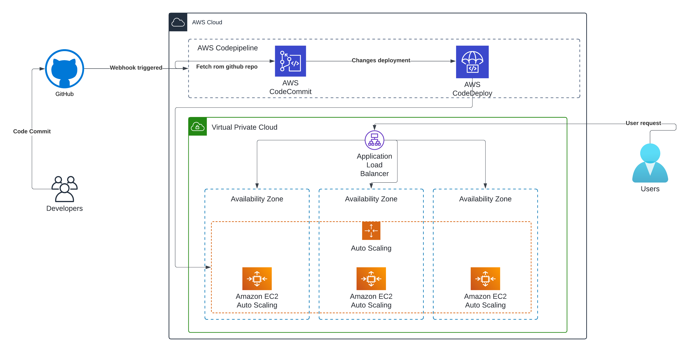

# Codeflow Symphony

This repository demonstrates a CI/CD pipeline using AWS services to automate the deployment of applications, specifically developed for automatic static website development and deployment. The pipeline ensures that code changes are continuously integrated, tested, and deployed to a production environment, providing a robust and scalable solution for application development and deployment.

(Workflow comming soon !)
